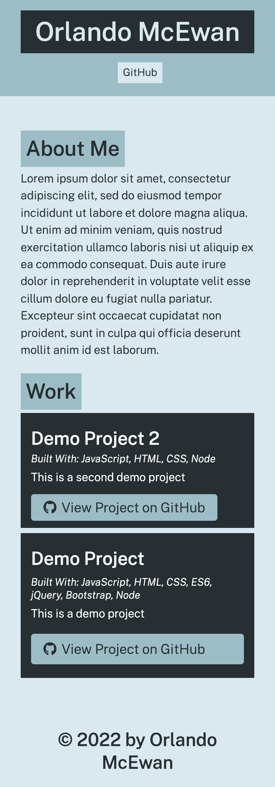

# Portfolio Generator 

## Purpose
Generate a portfolio page that displays all of your projects with links to Github. 

## How To Use
This project is run using node in the command line. By excuting the project with node you will be asked a sequence of questions about yourself and about the projects you want to display on the generated portfolio page. 

## Built With
    * JavaScript
    * Node.js

## Github Repo
https://github.com/omcewan/portfolio-generator

## Screenshot
